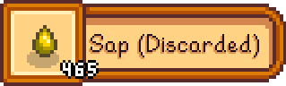

# Garbage In Garbage Can

*"If you drop one more dragon tooth into the lava because your bag was full of weeds and sap, then I am going to throw you in there with it."*

## Introduction

For better or for worse, limited inventory space is one of Stardew Valley's important balance mechanics. A lot of games have this. It's not unusual.

What *is* unusual, and frequently frustrating, is just how *quickly* the trash items start to pile up in your inventory, and how very easy it is to permanently lose a valuable item by not clearing your inventory in time.

- Went down a staircase, possibly accidentally due to janky hitboxes? There's no backtracking, so any items left on the ground are gone.
- Set a bomb or used the napalm ring near an item still on the ground? Now it's gone.
- Near water or lava and the item's random drop trajectory placed it out of bounds, and you didn't magneto-pull it in because inventory was full? Gone.
- Passed out at 2 am during a dive and that super-rare weapon/shard/luck ring is just sitting there, staring at you, mocking you, and your stupid character is refusing to pick it up because apparently that nearby stack of 5 wood was more important? RAGE.

Or perhaps this doesn't happen to you because you're meticulous about managing inventory. Perhaps you are used to the rhythm of opening the inventory menu every six seconds because you're near max capacity and every slime in the mobs you have to keep clearing each reliably drops *two* items you have no practical use for. Perhaps menuing is *fun* for you. Perhaps you are insane.

So what's a sane player/runner to do, other than cheat? The answer: this mod, right here. No longer will you be a slave to the trash items constantly accumulating in your backpack. Don't work for your inventory; make your inventory work for you. Insert your own slogan here.

Garbage In Garbage [Can], or GIGc, or just GIG, takes the items *you* consider to be trash, and makes sure they never clutter up in your inventory in the first place. Enjoy a pristine backpack, completely free of useless[^*] stacks of sap, slime, quartz crystals and dead bugs.

[^*]: Yes, these items do have *some* use, during specific parts of the game, depending on your goals and strategy. That's why *you* get to choose what's garbage. I picked those examples because they are trash for 99% of players, 99% of the time.

## Installation

GIG follows the standard installation procedure for most mods:

1. Install SMAPI and set up your game for mods, per the [Modding: Player's Guide](https://stardewvalleywiki.com/Modding:Player_Guide/Getting_Started) instructions.
2. Download the [latest release](https://github.com/focustense/StardewRadialMenu/releases). Make sure you download the `GarbageInGarbageCan x.y.z.zip` file, **not** the source code.
3. Open the .zip file and extract the `GarbageInGarbageCan` folder into your `Stardew Valley\Mods` folder.
4. Launch the game!

### Optional Dependencies

Configuration settings can be changed in-game using [Generic Mod Config Menu](https://www.nexusmods.com/stardewvalley/mods/5098). If you are one of the eight people not using GMCM, you can still use this mod and configure it using `config.json`. See [Configuration](#configuration) for more details.

## Features & Guide

GIG tries to preserve the game's balance and fit in smoothly with regular gameplay, while making inventory management less of a chore.

### Mark Items as Trash

When you start a new game or first install the mod, initially your trash filter will be empty.

To add an item to the filter - that is, to designate it as trash - simply trash it the normal way, i.e. by dropping it into your trash can from the inventory menu, while holding the [configured](#configuration) Modifier Key (default: <kbd>LeftControl</kbd>). You'll see a notification:


Afterward, any time you "pick up" this item, it will automatically get sent to the trash. It will still count as a pickup for the purposes of quests, mail, etc., but it will not appear in your inventory. If you haven't disabled trash notifications, you'll receive a separate notification when this happens:



This is the mod working as intended. You'll also be credited any money you'd get for trashing the item normally, i.e. based on your trash can's upgrade level.

### Recover Trashed Items

You might run into situations where items that you intended to keep get trashed - for example, when on a fetch quest, or when pulling a large stack out of a chest. For a limited time (default: 5 seconds), you can recover these items.

To open the recovery menu, hover over the trash can in your inventory menu **without** holding any item, like so:


Then, while holding the same Modifier Key that you use for [marking items](#marking-items-as-trash), click on the can or press the controller's action button (A). If any items are still available, you'll be presented with the recovery menu:


This menu acts similar to any other container, such as a chest, but you can't put items back. Once you take an item/stack, it will go back in your inventory and you'll lose the money you were credited for trashing it.

> [!NOTE]
>
> The recovery process can **only** be initiated from the inventory menu or "pause menu". If you click on the trash can in any other menu (such as a chest menu) using the modifier key, nothing will happen.

Items recovered this way are _temporarily_ exempt from trash rules; they will not be automatically trashed the instant you try to recover them. However, they are not _permanently_ exempt. In particular any _new_ items of the same type will get trashed instead of adding to the stack; or, if you've configured [Minimum Empty Slots](#minimum-empty-slots), then the original items may get trashed again as soon as you try to pick up a different item. In either case, if you want to hold onto them and/or continue to collect more, make sure to actually [mark them as non-trash](#trash-menu) after they're recovered.

If you waited too long to recover the items, or if you've disabled this feature entirely, then you won't get the recovery menu, and will instead see a notification:


This means you've passed the point of no return; any items that were previously trashed are gone forever and cannot be recovered.

### Trash Menu

The definition of trash is highly personal and highly situational; just ask Linus. By default, trash flags apply in the current location only, so you can collect wood when chopping down trees on the farm or in the forest but not when destroying crates in the mines/cavern.

Depending on the situation, you may want to do one of the following:

- Stop treating a particular item as trash, if you suddenly find yourself needing to collect it, e.g. for a quest; or
- Tag an item to be treated as trash _everywhere_, not just in the current location. For example, you might want to do this for [Trash](https://stardewvalleywiki.com/Trash_(item)), or other fishing trash.

These can be done in the Trash Menu, which can be brought up by pressing the Menu Key (default <kbd>G</kbd>):


Most of this should content should be self-explanatory... but just in case:

- Items with  can be auto-discarded in the player's current location. Press A (gamepad) or left-click (mouse) to toggle this.
- Items with  can be auto-discarded regardless of the player's current location. Press X (gamepad) or right-click (mouse) to toggle this.
- If the item's icon is fully opaque, the filter is _active in this location_ - i.e. it is _either_ discardable in this location _or_ discardable in all locations. If the item's icon is translucent, it is _not active in this location_.

> [!NOTE]
>
> If, as a result of your menu choices, an item is no longer considered a trash item in _any_ location, or globally, then it will disappear from the trash menu entirely the next time you open it. To make it reappear, you will have to [mark it as trash again](#mark-items-as-trash) in any location.

### Minimum Empty Slots

Cautious cats may want to avoid trashing any items until they actually need the inventory space for something else (i.e. _non-trash_). Perhaps you have a tendency to go coal farming in the mines at 11 PM when there's nothing else to do, and there's no reason to start trashing every Quartz crystal or Frozen Tear when you're not going to have a full inventory by the end of the day.

If you've decided to be a cautious cat, let GIG know by setting your Minimum Empty Slots to something other than zero:


The way this actually works in-game is as follows:

* If you pick up a trash item that fully stacks with another item in your inventory - i.e. is guaranteed not to occupy a new slot - then it will always be added to that stack.
* If the number of empty slots in your inventory is at or below the minimum, and you are about to pick up a trash item that does _not_ stack, then the trash item will be discarded instead of picked up.
* If you pick up a _non-trash_ item which causes the number of empty slots to go below the minimum, _and_ you have one or more trash items already in your inventory, then those trash items in your inventory will be _removed from your inventory_ (and sent to the trash can) until you either have the required number of empty slots, or until there is no more trash left in your inventory.

This is the more surgical solution to the originally-stated problem: "never leave a valuable item behind because of trash in the inventory" - but also don't aggressively throw out everything that's not valuable. This is closer to how a normal human would actually manage inventory, but without the endless cycle of menuing once the inventory is nearly full of valuable items.

> [!NOTE]
>
> There is no "trash priority" - trash is trash. When discarding trash as a result of picking up non-trash, your inventory will get searched in reverse position order, so if you really need to prioritize your trash, put the "important" trash at the top/left of your inventory.
>
>
> ...but really, just bring up the [Trash Menu](#trash-menu) and set the item as not-trash if you want to start collecting it again. The mod is supposed to make your life easier, not harder.

### Trash Persistence

Your trash items are _per-save_, so that when you start a new game and actually need all that sap, fiber, and so on, you don't have to go into the menu and disable them.

Because the definition of trash is so context-sensitive, there is presently no "game-wide" or "default" trash list that would apply to every existing save, or every newly-created file.

[Mod configuration](#configuration) is different from trash filters, is not save-specific, and changes are applied immediately regardless of save file.

## Configuration

All of this mod's options are configurable through GMCM. If you prefer to edit the `config.json` or are having any trouble with the in-game settings, read on for a detailed explanation of what the settings do.

<details>
<summary>Example Configuration</summary>

```json
{
  "EnableTrashNotification": true,
  "SuppressPickupNotification": true,
  "MenuKey": "G",
  "ModifierKey": "RightShoulder",
  "MinEmptySlots": 2,
  "RecoveryLimit": "00:00:05"
}
```
</details>

### Settings

**These settings are global; unlike your current "trash list" or "trash filter", they are not per-save.**

* `EnableTrashNotification`: Whether to show a HUD notification when an item gets automatically discarded by the mod.
* `SuppressPickupNotification`: Whether to suppress the item pickup notification that would normally show just _before_ the item gets trashed. It's best to leave this enabled if `EnableTrashNotification` is also enabled, so that you don't see two nearly-identical messages for the same item stack.
* `MenuKey`: The key binding to open the trash menu, where you can enable/disable specific trash items. Unlike the GMCM page, the JSON format can accept a list, such as `G, RightStick`, but if you want to set up controller support for the menu, you're better off using [Radial Menu](https://www.nexusmods.com/stardewvalley/mods/25257).
* `ModifierKey`: The key to **hold** while trashing an item to mark it as trash, or while clicking on the trash can without any held item to bring up the recovery menu. In the example above, it's been changed from the default `LeftControl` to `RightShoulder` to work with gamepads.
* `MinEmptySlots`: Number of empty inventory slots to try to maintain. Default is `0` which turns this feature off; in the example above, we've chosen `2`, which will only trash items when the inventory reaches 2 slots or fewer.
* `RecoveryLimit`: Maximum amount of time before trashed items disappear forever and can no longer be recovered via the recovery menu (see `ModifierKey` above). The example above uses the default limit of 5 seconds. Note that this is in **real** seconds, not in-game time; however, the counter only counts down while your character is in-play, so items won't disappear while the game is paused, in the middle of a dialogue/cutscene, etc.

## Questions/Bugs?

Feel free to either:

* Create a [GitHub issue](https://github.com/focustense/StardewRadialMenu/issues); when doing so, please follow bug-reporting etiquette. Check first for similar reports, and make sure to include all relevant details about your issue, especially including clear repro steps and/or [SMAPI log](https://smapi.io/log).
* Or, ping me on the [SV Discord](https://discord.com/invite/stardewvalley) if I happen to be around. Discord is best if you have a quick question, but I make no promises re: availability for in-depth troubleshooting.

## See Also

* [Changelog](CHANGELOG.md)
